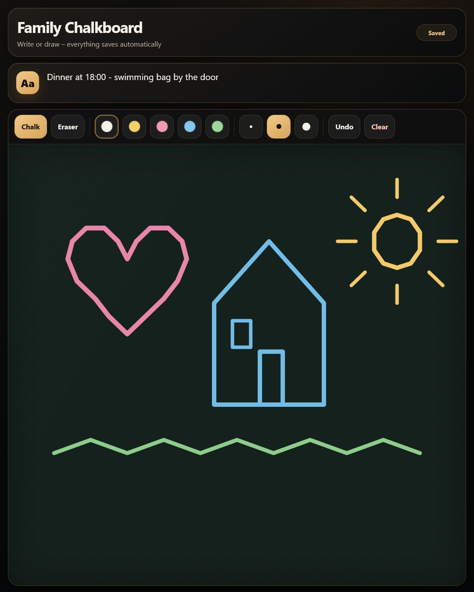

# Home Assistant Family Chalkboard

[](https://github.com/HjortCreations/home-assistant-family-chalkboard/actions/workflows/ci.yml)
[](https://github.com/HjortCreations/home-assistant-family-chalkboard/actions/workflows/validate.yml)
[](LICENSE)

A touch-first family chalkboard for Home Assistant dashboards and wall-mounted
kiosks. Draw with a finger or stylus, leave a short note, and keep everything
saved across reloads and restarts. Install it through HACS as a native Home
Assistant panel, or run the dependency-free standalone server.



## Why this exists

Home Assistant has excellent controls, calendars, and task lists, but a shared
wall display sometimes needs something less structured: a quick handwritten
message, a child's drawing, or a note that the whole household can see.

Family Chalkboard is deliberately focused:

- no JavaScript framework;
- one shared board;
- Home Assistant-backed storage and authentication when installed with HACS;
- a dependency-free standalone option for any small home server.

## Features

- Finger, stylus, and mouse drawing
- Five chalk colors and three line widths
- Eraser and undo
- Shared family note
- Clear confirmation to prevent accidental deletion
- Automatic saving and live updates across open screens
- Automatic board sizing for portrait, landscape, and smaller screens
- Proportion-preserving viewing with an optional full-area mode per browser
- Responsive portrait and landscape layouts
- English and Swedish interface
- HACS custom integration with a one-click config flow
- Home Assistant authentication and protected `.storage` persistence
- Strict payload validation
- Optional standalone health endpoint and configurable write allowlist
- Docker Compose and hardened systemd examples

## Install with HACS

Requirements:

- Home Assistant 2025.1 or later
- HACS

[](https://my.home-assistant.io/redirect/hacs_repository/?owner=HjortCreations&repository=home-assistant-family-chalkboard&category=integration)

Or add it manually:

1. Open HACS.
2. Open the three-dot menu and select **Custom repositories**.
3. Add
   `https://github.com/HjortCreations/home-assistant-family-chalkboard`
   with the category **Integration**.
4. Download **Family Chalkboard** and restart Home Assistant.
5. Open **Settings → Devices & services → Add integration**.
6. Search for **Family Chalkboard** and confirm the setup.

The **Family Chalkboard** panel now appears in the sidebar. It uses Home
Assistant's authenticated WebSocket connection and stores its shared state in
Home Assistant. No separate port, container, dashboard resource, or YAML is
needed.

The panel follows the Home Assistant language. Add `?lang=en` or `?lang=sv` to
its URL to override it.

### Screen sizes and orientation

Family Chalkboard measures the space actually available to the drawing area,
not the device's advertised screen resolution. This accounts for browser UI,
Home Assistant sidebars, and dashboard headers automatically.

The first stroke on a new board records that drawing area's aspect ratio. The
default **Fit** mode then preserves the drawing's proportions on other portrait
or landscape screens and centers it in the largest possible area. Use the
**Fill** button to fill the entire drawing area when that is more important than
preserving the exact proportions. This viewing preference is stored only in
the current browser, so one display can use **Fit** while another uses **Fill**.

Clearing the board also clears its recorded format. The next stroke adopts the
current drawing area's format. Boards saved by version 1 remain readable and
keep their previous behavior until a new format is established.

### Add a dashboard navigation button

```yaml
type: button
name: Chalkboard
icon: mdi:draw
tap_action:
  action: navigate
  navigation_path: /family-chalkboard
```

## Standalone server

The original standalone version remains available for people who do not use
Home Assistant or HACS.

### Docker Compose

```bash
git clone https://github.com/HjortCreations/home-assistant-family-chalkboard.git
cd home-assistant-family-chalkboard
docker compose up -d --build
```

Open `http://YOUR_SERVER_IP:8765/`.

Board data is stored in the Docker volume `chalkboard-data`.

### Python

Python 3.11 or later is recommended. No packages need to be installed.

```bash
git clone https://github.com/HjortCreations/home-assistant-family-chalkboard.git
cd home-assistant-family-chalkboard
python src/chalkboard_server.py
```

The default address is `http://0.0.0.0:8765/`, and the state file is written to
`./data/board.json`.

### systemd

On Debian, Raspberry Pi OS, and similar distributions:

```bash
sudo ./scripts/install-systemd.sh
```

The installer copies the app to `/opt/family-chalkboard`, installs the included
unit, and enables it immediately. State is stored in
`/var/lib/family-chalkboard/board.json`.

Check it with:

```bash
systemctl status family-chalkboard
curl http://127.0.0.1:8765/health
```

### Embed the standalone server

Add a Webpage card to a dashboard:

```yaml
type: iframe
url: http://YOUR_SERVER_IP:8765/?lang=en
aspect_ratio: 165%
```

Use `?lang=sv` for Swedish. Without a language parameter, the app follows the
browser language.

#### HTTPS note

Browsers block an HTTP iframe inside an HTTPS Home Assistant page. If Home
Assistant is served over HTTPS, expose Family Chalkboard through an HTTPS
reverse proxy as well. A local kiosk that loads both services over HTTP does
not have this mixed-content restriction. The HACS integration does not have
this issue because it is served directly by Home Assistant.

### Standalone configuration

Settings can be supplied as command-line flags or environment variables.

| Purpose | Flag | Environment variable | Default |
| --- | --- | --- | --- |
| Listen address | `--host` | `CHALKBOARD_HOST` | `0.0.0.0` |
| Port | `--port` | `CHALKBOARD_PORT` | `8765` |
| Data directory | `--data-dir` | `CHALKBOARD_DATA_DIR` | `./data` |
| Networks allowed to save | `--allowed-networks` | `CHALKBOARD_ALLOWED_NETWORKS` | Loopback and private networks |
| Request logging | `--verbose` | `CHALKBOARD_VERBOSE=true` | Off |

Example:

```bash
python src/chalkboard_server.py \
  --host 0.0.0.0 \
  --port 9000 \
  --data-dir /srv/chalkboard \
  --allowed-networks 127.0.0.0/8,192.168.1.0/24
```

The allowlist controls **writes**. Anyone who can reach the HTTP port can read
the board, which is necessary for a Home Assistant iframe.

## Backups

The HACS integration stores its state in Home Assistant's
`.storage/family_chalkboard.board` file, which is included in normal Home
Assistant configuration backups. Do not edit that file while Home Assistant is
running.

For standalone installations, back up the single `board.json` file in the
configured data directory. Docker Compose stores it in the
`chalkboard-data` volume.

## Security

The HACS integration is available only to authenticated Home Assistant users.
The standalone server is designed for a trusted home network and has no
built-in user accounts. Do not expose the standalone port directly to the
public internet.

See [SECURITY.md](SECURITY.md) for the security model.

## Development

Run the test suite:

```bash
python -m unittest discover -s tests -v
python scripts/check_frontend.py
```

The standalone project intentionally avoids runtime dependencies. Please keep
changes focused and include screenshots for interface updates. HACS and
Hassfest validation run automatically in GitHub Actions.

## Limitations

- The board is shared and uses last-write-wins behavior.
- There is no user history or per-user board.
- The HACS version is a full panel rather than a small dashboard card.
- The standalone version has no built-in authentication.
- Very large, long-lived drawings will eventually reach the configured state
  limits and should be cleared.

## License

[MIT](LICENSE) © 2026 Per Hjort
